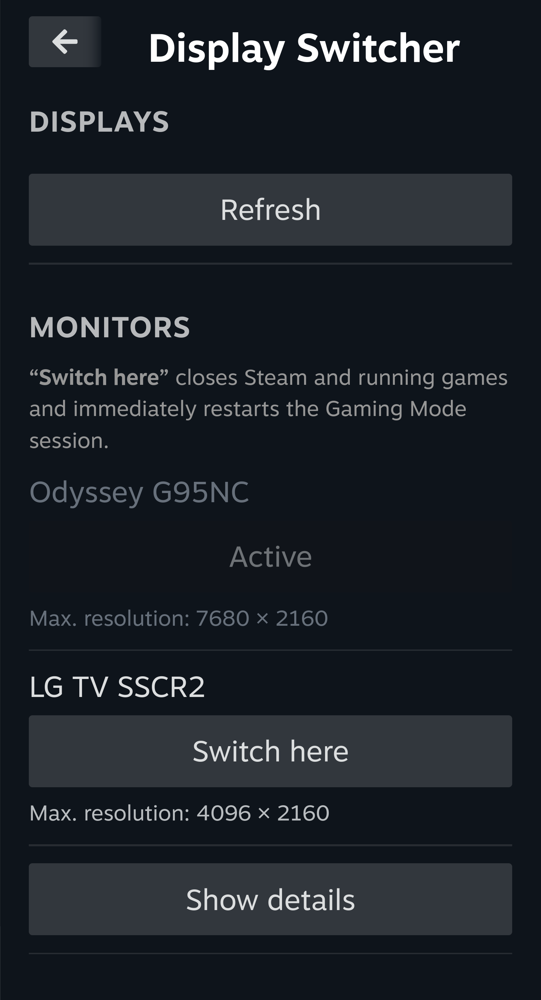

# Display Switcher

A Decky plugin for switching between connected monitors in SteamOS Gaming Mode.



## Requirements

- Decky Loader with plugin API 1 and the modern `@decky/api` / `@decky/ui` APIs.
- A Gamescope session managed by `gamescope-session.service` and
  `gamescope-session.target` in the systemd user manager.
- A stock session service under `/usr/lib` or `/lib`, with one absolute script
  path in `ExecStart`. The shell script must launch Gamescope exactly once using
  an unqualified `exec gamescope` and must not override `PATH`.
- `gamescope`, `gamescopectl`, `systemctl`, and Python 3.10+ on `PATH`.
  Gamescope must report active display information through its control protocol.

The plugin supports arbitrary monitors, but not arbitrary session managers.
Unsupported stock scripts and existing `ExecStart` overrides are left unchanged;
monitor discovery remains available with a diagnostic message. The plugin does
not manage resolution or refresh rate.

## Usage

Open Decky → **Display Switcher**, then select **Switch here**
for the desired monitor.

**Switching starts immediately, without a confirmation dialog. It closes Steam
and running games, then restarts the Gaming Mode session.** Unsaved game progress
may be lost. The screen may go black during the restart.

The current output is detected through a read-only `gamescopectl` invocation.
Its button shows **Active** and is disabled. DRM encoder state and the
saved preference are not treated as proof of the active output. Switching is
blocked when Gamescope's current output cannot be identified unambiguously.

The compact view lists connected monitors and their **Max. resolution**.
**Show details** expands connector information,
DRM state, monitor identity, startup preference, and session integration. The
restart warning appears in the **Monitors** section and names the
switch button explicitly. **Refresh** reads the current state
after a hotplug or cable change without restarting the session.

Maximum resolution is the advertised connector mode with the largest pixel
count, not the current or native panel resolution. Refresh rates are not inferred
from sysfs mode names. DRM writeback targets are not offered as monitors.

## Startup preference and fallback

Switching saves the preferred monitor identity atomically as versioned JSON in
Decky's settings directory. A usable EDID serial number associates the preference
with the monitor rather than its port. Without a serial number, the complete
valid EDID hash is used; without valid EDID, the preference is connector-bound.
Identical EDIDs cannot be distinguished without additional device information;
the saved connector breaks that tie. HDMI extension-count overrides are supported,
while the full declared EDID length and checksums of every block remain required.

At each session start, the Gamescope shim checks connected monitors. If the
preferred monitor is missing, it uses the sole DRM-enabled connected output,
or otherwise the first connected output in stable connector order. This does
**not** overwrite the saved preference: when the preferred monitor returns,
it is selected at the next session start. With no connected output, Gamescope's
stock wildcard priority is preserved. This is a startup fallback, not a service
that restarts the session on hotplug.

## Installation and removal

Install the ZIP through Decky's **Install from URL** option or ZIP file picker.
For URL installation, the package must be reachable from the SteamOS machine.
Decky handles installation, ownership, and plugin loading.

When loaded, the plugin creates this user-service drop-in:

```text
~/.config/systemd/user/gamescope-session.service.d/90-display-switcher.conf
```

It runs the unchanged stock session script through `session.py`. A temporary
PATH shim sets Gamescope's output priority and removes itself from `PATH` before
launching the real Gamescope. Game arguments are preserved. Setup and
`daemon-reload` do **not** restart the running session; integration applies to
future starts and explicitly requested output switches. System commands use the
original library search path rather than Decky's bundled runtime libraries;
Decky's own environment is unchanged.

The plugin runs as Decky's normal user and uses that user's systemd bus. It
contains no passwords or SSH credentials. Removal deletes only the unchanged,
plugin-managed drop-in and reloads systemd without restarting the session.
External or subsequently modified configuration is preserved. A normal plugin
reload retains session integration.

## Development

Use Node.js, Python 3.10+, and pnpm 9. Steam and Decky supply React and the Decky UI
at runtime; these libraries are not bundled into the plugin.

Tests cover monitor selection, preferences, and session management. Output
detection and the interface have been checked on SteamOS. Live switching and
startup fallback with a real session restart have not yet been hardware-tested.

```sh
corepack pnpm install --frozen-lockfile --ignore-scripts
corepack pnpm test
corepack pnpm package
```

Without Corepack:

```sh
npm exec --yes --package=pnpm@9.15.9 -- pnpm install --frozen-lockfile --ignore-scripts
npm exec --yes --package=pnpm@9.15.9 -- pnpm test
npm exec --yes --package=pnpm@9.15.9 -- pnpm package
```

`pnpm package` produces two files:

- `release/display-switcher-2.0.4.zip`: the installable Decky plugin, including
  license texts, third-party notices, and an embedded `sources.zip`.
- `release/display-switcher-2.0.4-source.zip`: the complete plugin sources,
  build configuration, lockfile, and matching Decky API sources.

The embedded `sources.zip` is identical to the separate source archive. To
rebuild, extract it and run the installation and build commands above from
`display-switcher-2.0.4-source`. Building does not require a Steam client.

`@decky/api` is compiled directly from `third_party/decky-api/src/index.ts`,
not from a prebuilt npm package. To use a modified library, edit the files under
`third_party/decky-api/src/` and run `pnpm package` again. Rollup and TypeScript
both resolve the API to that source path. The provenance file
`third_party/decky-api-source.json` records the original upstream source.
Mark library changes with their dates and update the third-party notices
accordingly; the library remains under its LGPL license.

## License

The plugin's own code is licensed under [MIT](LICENSE). Third-party components
retain their respective licenses. The [third-party notices](docs/third-party-notices.md)
cover Decky API, React Icons, Font Awesome, and template material. License texts
in `licenses/` are included with every release. Matching LGPL sources and rebuild
instructions are supplied in the source archive, also embedded in the plugin ZIP.

## Troubleshooting

Stale selections, disconnected monitors, unreadable preferences, unsupported
session formats, and systemd failures are reported in the interface. Refresh
after hotplug. A successful restart requires a new session invocation, the
plugin-managed configuration to be loaded, an active service and target, and
Gamescope confirming the requested output; an exit code alone is insufficient.
Once a restart has been requested, a later error cannot guarantee that the
session remained unchanged.

```sh
systemctl --user show gamescope-session.service -p ExecStart -p ActiveState
systemctl --user cat gamescope-session.service
gamescopectl
journalctl --user -u gamescope-session.service
journalctl -u plugin_loader.service
```

Documentation: [official references](docs/references.md), [changelog](CHANGELOG.md),
[third-party components and licenses](docs/third-party-notices.md).
